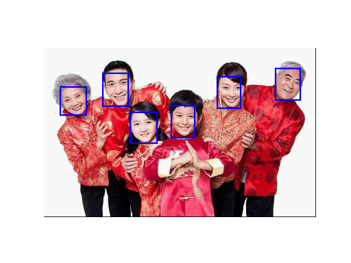

.. _bob.ip.facedetect.tinyface:

==============================
 Face detection using TinyFace
==============================

This package comes with a TinyFace face detector. The Original Model is ``ResNet101`` 
from `tinyface <https://github.com/peiyunh/tiny>`_. Please check for more details on TinyFace. The 
model is converted into MxNet Interface and the code used to implement the model are 
from `hr101_mxnet <https://github.com/chinakook/hr101_mxnet>`_.

Implementation
--------------

See below for an example on how to use :any:`bob.ip.facedetect.tinyface.TinyFacesDetector`:

.. literalinclude:: plot/detect_faces_tinyface.py
   :linenos:

This face detector can be used for detecting single or multiple faces. If there are more than one face, the first entry of the returned annotation supposed to be the largest face in the image. 
  
  

  Multiple faces are detected by TinyFace.
